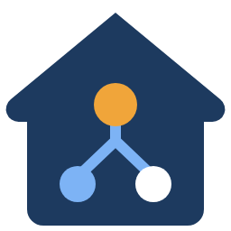
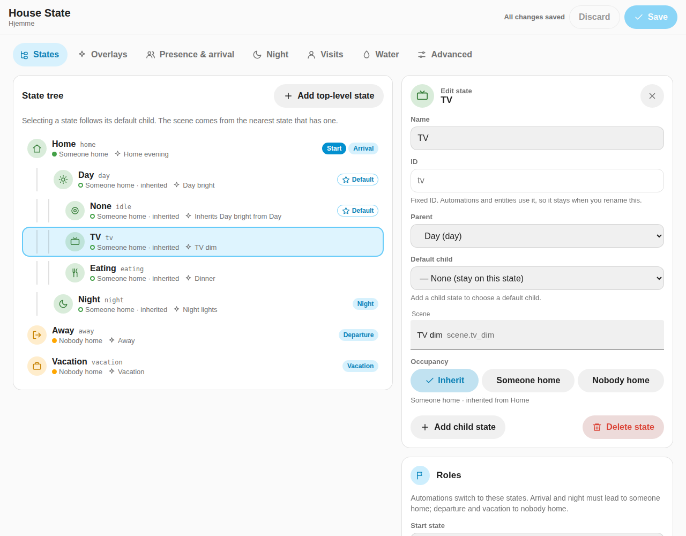
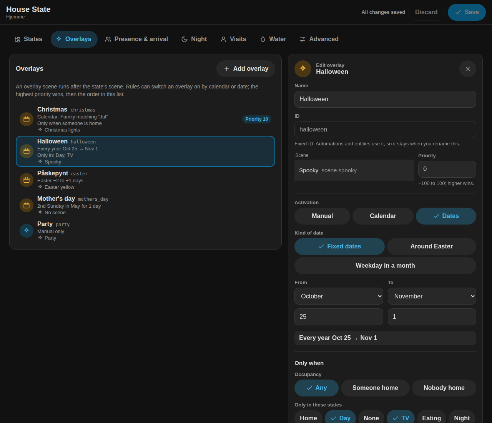

# House State

Build your house's state tree in Home Assistant. Every state, parent, scene,
overlay and automation role is configurable. The integration owns scene
application and publishes native selects for dashboards, voice and automations.
English and Norwegian Bokmål settings are included.

## Install

Requires Home Assistant **2026.2 or later**. Add
`https://github.com/mvheimburg/house-state` as a HACS custom repository with
category **Integration**, install and restart Home Assistant. Alternatively,
copy `custom_components/house_state` into your HA configuration's
`custom_components` directory. Add **House State** under Settings → Devices &
services. One entry represents one house; multiple houses are independent.

The optional [House State card](https://github.com/mvheimburg/lovelace-house-state)
provides everyday state and overlay controls, Apply scene now, and a compact
view of the active path. Its settings cog links to the integration page. The
integration also works without that card, including with Bubble select cards.

## Build your tree

The editable starter template is Home → Day → None/TV/Eating, Home → Night,
Away, and Vacation. These names and IDs carry no built-in behavior. Add roots,
children and deeper levels; move or rename nodes; assign a scene at any level.
Open **Settings → Devices & services → House State → Configure**. Structured
menus and forms let you edit states, parent/default-child relationships, scenes,
occupancy, initial state and roles; overlays and their activation rules; trigger
entities and automatic arrival/departure; guest visits; water valves; night
schedules; and legacy mirrors.
The `house_state.set_config` action remains available for automations.

Edits stay in a draft until you choose **Save** and submit its confirmation.
Closing the flow or choosing **Discard changes** leaves saved settings untouched.
Forms include a return-without-changing-this-form option. You can adjust related
settings in several sections before saving; validation checks the complete draft
and identifies problems before anything is persisted. Missing members inside a
scene produce a warning to acknowledge before saving.

State IDs remain stable when editing names or relationships. Removing a state
promotes its children to its parent and clears references from default children
and roles. If it was the initial state, select a replacement. You cannot remove
the final state or the only state restriction of an overlay rule; edit that rule
first. These safeguards avoid silently broadening when an overlay activates.

Selecting a node follows its `default_child` recursively. Without a default,
the selected parent can remain active itself. Scene resolution walks from the
active node toward its root, using the first configured scene. A configured
overlay scene runs afterwards and works in any state.

`occupied` means someone is home. A node can set true, false, or null to inherit
from its nearest ancestor; without an explicit ancestor it is false. Automation
roles refer to node IDs: arrival/night must resolve occupied, and
departure/vacation must resolve unoccupied. Set any role to null to disable it.
Defaults are an arrival role on `home`, departure on `away`, vacation on
`vacation`, and night on `night`.

Configuration edits **do not apply scenes**. Use **Apply scene now** afterwards
if needed. Removing the active node selects the initial state and follows its
defaults; removing the active overlay selects `none`. Node renames preserve the
active ID and timestamp. Native branch selects are added/removed automatically.

## Configuration panel

Administrators get a **House State** page in the sidebar that shows the whole
configuration at once and edits it in place. It is an alternative to the
step-by-step **Configure** flow, which still works. Both save the same
settings.



- **States** shows the tree with indentation. Each state shows whether someone
  is home (set on the state or inherited), its scene or where the scene comes
  from, and badges for the start state, default children and roles. Select a
  state to change its name, parent, default child, scene and occupancy, or to
  add a child. **Roles** sets the start state and the arrival, departure,
  vacation and night targets, and warns when a target leads to the wrong
  occupancy. Deleting a state first lists everything it changes: children move
  up, defaults and roles are cleared, and overlays stop listing the state. It
  refuses when an overlay would lose its only allowed state.
- **Overlays** lists every overlay with its rule written out, for example
  "Every year Dec 1 → Dec 26", "Easter −2 to +1 days" or "2nd Sunday in May for
  1 day". The editor covers the scene, priority, manual, calendar or date
  activation, and the occupancy and state conditions.
- **Presence & arrival**, **Night**, **Visits**, **Water** and **Advanced**
  (legacy input_select mirrors) hold the remaining settings. Durations are
  entered in hours, minutes or seconds as they suit. The night offset is set in
  minutes before or after sunset or sunrise.



Changes stay in a draft until **Save**. **Discard** returns to the saved
settings. Obvious problems show up next to their field while you edit; on Save,
the integration validates the whole draft and shows any error. Missing scenes or
scene members open a confirmation that lists them before anything is stored. If
the settings changed elsewhere in the meantime, the page offers to reload them
rather than overwrite that change. Saving reloads House State and never applies
scenes. IDs can be edited only on new states and overlays before their first
save. The page follows Home Assistant's language (English or Norwegian Bokmål)
and theme, and switches to a single column on phones.

## Entities

For an entry named House, defaults are:

| Entity | Purpose |
|---|---|
| `sensor.house_state` | Hub, whose state is the active node ID |
| `select.house_state` | Root state IDs |
| `select.house_home`, `select.house_day` | Direct children of each configured parent |
| `select.house_overlay` | `none` plus configured overlay IDs, and `auto` where rules exist |
| `binary_sensor.house_occupied` | Inherited occupancy |
| `binary_sensor.house_visit` | On while a guest visit is active; attributes describe the active or last visit |

Branch selects are unavailable while their parent is not on the active path.
Every node with children gets a select. Entity IDs derive from configured names
when first created; Home Assistant retains them after renaming. Select options
use stable IDs; the card displays the configurable names.

The hub attributes are `state`, `active_path` (root to leaf IDs), `state_tree`,
`overlays`, `overlay`, `overlay_choice`, `overlay_rule`, `overlay_hold_until`,
`scene_stale`, `occupied`, `last_scene`, `last_changed_by`, `since`,
`previous_state`, `application_pending`, `scene_warnings`, `config`,
`auto_return_enabled`, `night_schedule`, `available_overlays`, `visit` (the
active visit or null), `last_visit` and `water` (the last valve change).

## Actions

All actions target the hub sensor; normal HA entity/device/area targeting is
supported. Use the sensor ID for an unambiguous single-house target.

```yaml
action: house_state.set
target:
  entity_id: sensor.house_state
data:
  state: tv
  overlay: christmas
  reason: user
```

| Action | Fields |
|---|---|
| `house_state.set` | `state` and/or `overlay`, optional `reason`, `force` (false) |
| `house_state.arrive` | optional `reason`; no-op when already occupied |
| `house_state.depart` | `vacation` (false), optional `reason` |
| `house_state.apply_scene` | `force` (true) |
| `house_state.set_config` | Any configuration fields below |
| `house_state.visit_start` | optional `visit_id`, `duration`, `source`, `actor`; returns the visit |
| `house_state.visit_end` | optional `visit_id`; returns the outcome and cleanup result |

Reasons are `user`, `door`, `gate`, `presence`, `schedule`, `service` (default).
Explicit arrive/depart actions reject a disabled role. Automated triggers ignore
disabled roles. A single set call selects the entire path and applies one base
scene, then the overlay; it never fires all intermediate scenes.

Dedupe compares the resolved base/overlay pair. Selecting a different node
whose scenes are identical updates state but does not call scenes again.
Changing an overlay reapplies the base and then the new overlay. Turning an
overlay off does not reverse its actions: put the desired reset behavior in the
base scene. `force: true` resynchronizes devices.

## Configuration schema

`set_config` accepts any subset. Arrays and objects replace the entire field;
update tree, roles and initial state together when removing referenced nodes.
Other options are preserved. Everything is validated before saving.

```yaml
action: house_state.set_config
target:
  entity_id: sensor.house_state
data:
  state_tree:
    - {id: here, name: At home, parent: null, scene: "", default_child: relax, occupied: true}
    - {id: relax, name: Relaxing, parent: here, scene: "", default_child: null, occupied: null}
    - {id: sleep, name: Sleeping, parent: here, scene: "", default_child: null, occupied: null}
    - {id: out, name: Out, parent: null, scene: "", default_child: null, occupied: false}
  initial_state: here
  roles: {arrival: here, departure: out, vacation: null, night: sleep}
  overlays:
    - {id: guests, name: Guests, scene: ""}
    - {id: christmas, name: Christmas, scene: "", dates: {type: fixed, from: "12-01", to: "12-26"}}
    - {id: birthday, name: Birthday, calendar: calendar.family, priority: 1}
  door_entities: [lock.front_door]
  gate_entities: [cover.garage]
  person_entities: [person.alex]
  auto_return: true
  auto_away: false
  auto_away_grace: 300
  arrival_delay: 3
  night_schedule: {type: fixed, time: "22:00:00"}
  legacy_mirror: {}
  visit_duration: 7200
  visit_max_duration: 43200
  visit_exit_grace: 120
  visit_reapply_scene: true
  visit_lock_entities: [lock.front_door]
  water_valves: [valve.main_water]
```

IDs match `[a-z][a-z0-9_]*` with at most 64 characters. Names are nonempty and
at most 100 characters. Parents/default children/roles must exist; a default
child must be directly below its parent. Cycles, duplicates and unknown fields
are rejected. At least one state is required. Overlay IDs `none` and `auto` are
reserved.
Every nonempty scene must be an existing scene entity. Missing entities inside
scenes produce warnings in setup/options and in `scene_warnings`; they do not
prevent saving the scene. The Configure flow provides structured forms for these fields; the dashboard
card keeps everyday actions and display options. Existing stored configuration
and service payloads remain compatible.

Defaults: auto-return true, auto-away false, 300-second grace, empty trigger
entity lists, schedule off, no legacy mirrors. Schedules accept `{type: off}`, a
fixed local HA time `{type: fixed, time: "22:00:00"}`, or
`{type: sun, event: sunset, offset: -1800}`. Sun event can be sunrise or sunset;
offset is signed seconds, within ±86400. HA location/timezone determines times.

Door return requires locked/unlocking → unlocked. Gate return requires a known
closed → opening/open transition. Both wait `arrival_delay` seconds (default 3,
at most 60; 0 arrives at once) before selecting the arrival role. Whoever
unlocked may report it a moment after the lock does — for example a door panel
announcing a guest over MQTT while the lock itself reports over KNX — and a
guest visit that starts within the delay suppresses the arrival. Further lock or
cover edges during the delay share the pending arrival. Person arrival selects
the arrival role at once.
Auto-away waits until all configured persons have known non-home states for the
full grace period; unknown, unavailable or missing persons cancel that timer.
The night schedule selects its role only while occupied and outside that role's
subtree. Grace timers and listeners are canceled on unload/options changes; a
new grace period starts after reload if everyone is still away.

Visit settings are in seconds: `visit_duration` (default 7200) and
`visit_max_duration` (43200) lie between 60 and 604800, and the default cannot
exceed the maximum; `visit_exit_grace` (120) lies between 0 and 3600. The
Configure form shows visit lengths in minutes.

## Date-driven overlays

An overlay is a **mode** that consumers read, plus an **optional scene**. Leave
`scene` empty and the overlay is a pure label: it changes what a doorbell plays
or a dashboard theme shows, and house-state touches no devices at all.

An overlay with a `calendar` or a `dates` rule turns itself on:

```yaml
overlays:
  - {id: birthday, name: Birthday, scene: "", calendar: calendar.family_birthdays}
  - {id: christmas, name: Christmas, scene: "", calendar: calendar.seasons, match: "^jul"}
  - {id: halloween, name: Halloween, scene: "", dates: {type: fixed, from: "10-25", to: "11-01"}}
  - {id: easter, name: Easter, scene: "", dates: {type: easter, from: -7, to: 1}}
  - {id: advent, name: Advent, scene: "", dates: {type: nth_weekday, weekday: sun, nth: -4, anchor: "12-25", days: 28}}
```

`calendar` is any calendar entity — the Holiday integration, a Local Calendar,
Google, CalDAV. The overlay is active while an event is running on it; `match`
is a case-insensitive regular expression tested against event summaries, which
matters because holiday summaries are generated rather than chosen, and are
translated with Home Assistant's language. An overlay takes a calendar or
dates, never both.

`dates` types, all evaluated against local dates:

| Type | Fields | Window |
|---|---|---|
| `fixed` | `from`, `to` as `MM-DD` | inclusive; wraps New Year when `to` precedes `from` |
| `easter` | `from`, `to` as day offsets (±180) | around computed Easter Sunday |
| `nth_weekday` | `weekday`, `nth` (±1–5), one of `month` or `anchor`, `days` (1) | `days` long from the computed day |

Easter is the reason date rules exist at all: it moves 25 days and no calendar
recurrence expresses it. `nth_weekday` with an `anchor` counts weekdays strictly
before (negative `nth`) or after (positive) that date, which is what Advent
actually is — the fourth Sunday before 25 December, not a fixed Sunday of
December.

`when_occupied: true|false` and `when_state: [id, ...]` restrict a rule; a state
ID matches anywhere on the active path, so naming a parent covers its subtree.
Overlapping rules resolve by `priority` (higher wins, default 0) and then by
configuration order, so a birthday can beat a four-week Christmas.

### Rules set the mode; people and events apply the scene

A rule-driven change is **quiet**: it publishes the overlay immediately and
fires `overlay_changed`, but does not call any scene. The deferred scene lands
on the next application that was going to happen anyway — someone comes home,
the night schedule fires, a state is selected, or **Apply scene now** is used.
So the mode flips at midnight on 1 December while the tree comes on when
somebody walks in. `scene_stale` is true during that window.

A change you make by hand is eager and applies scenes at once. To make an
overlay scene land at a specific hour, write an automation on `overlay` — that
is a consumer's decision, not the hub's.

### The overlay select has three kinds of option

`auto` follows the rules and is offered only when at least one overlay defines
one. `none` means *not today* and outranks every rule. Any overlay ID is an
explicit choice.

A hand-picked choice holds until the start of the next local day, published as
`overlay_hold_until`, and survives a restart, so a 22:00 reboot does not
reinstate Christmas. A rule window opening during a hold does not take over.
Selecting `auto` hands the axis back immediately. With no rules configured there
is nothing to hand back to, and a choice never expires.

`overlay` is the overlay in force, `overlay_choice` is what is selected on the
axis, and `overlay_rule` is what the rules would pick right now.

Rules are re-evaluated at startup, at local midnight, when a configured calendar
entity changes, on configuration reload, and as part of every state transition,
so `when_state` and `when_occupied` resolve together with the state change
rather than costing a second scene application. A calendar that cannot be read
keeps the previous answer and logs a warning instead of flapping an overlay off.

## Guest visits

A guest visit lets someone into an empty house without the house deciding
that the family came home. The visit sits beside the state and overlay: the
house stays in Away or Vacation, with Christmas still active, while a cat-sitter
is inside. Configure it under **Settings → Devices & services → House State →
Configure → Guest visits**.

| Situation | Behavior |
|---|---|
| A visit starts | State and overlay are unchanged; the visit timer starts |
| A configured lock or cover opens during the visit, or up to `arrival_delay` before it starts | Not an arrival; `arrival_suppressed` is fired |
| The same, within the exit window after the visit | Not an arrival: that is the guest walking out |
| A configured person comes home | Normal arrival; the visit ends with outcome `arrived` and no cleanup |
| Any other change into an occupied state | The same: the family is home, so the visit is over |
| The visit ends or expires while nobody is home | Cleanup: reapply the scene, then lock and verify the configured locks |
| The visit ends or expires while someone is home | Cleanup is skipped |
| A lock or cover opens with no visit | Today's automatic arrival, unchanged |

Only one visit is active. Starting another supersedes it (outcome
`superseded`, no cleanup), so an earlier guest's link or timer can no longer end
the newer visit. The visit and its expiry are stored; after a restart the timer
resumes, and a visit that expired while Home Assistant was stopped ends, with
its cleanup, once Home Assistant has started.

**Cleanup reports what happened; it does not assume it.** The scene result is
`applied`, `skipped` (someone arrived meanwhile), `failed` or `disabled`. Each
lock reports `locked` only after its state is `locked`, waiting up to 30
seconds after the lock accepts the command. Otherwise it reports `unverified`,
`jammed`, `failed` (the command was refused) or `unavailable`, or `skipped` if
someone arrived meanwhile. Any failure makes the cleanup `status` `failed`,
logs a warning, and is published in `last_visit` and the `visit_ended` event.

### Starting and ending a visit

```yaml
action: house_state.visit_start
target:
  entity_id: sensor.house_state
data:
  visit_id: 3f0c9d6e-7a41-4d8e-9a1b-2c5e8f7d6a10
  duration: {hours: 2}
  source: doormonitor
  actor: Cat sitter (guest link)
response_variable: visit
```

The response holds `status` (`started`, or `active` when the same `visit_id` is
already running, which leaves its expiry unchanged), `id`, `started`, `expires`,
`source`, `actor`, and the Home Assistant `user_id` and `user_name` of the
caller when known. Without `visit_id` an ID is generated. Reusing the ID of a
visit that has ended is rejected. `duration` defaults to `visit_duration` and
must be between 60 seconds and `visit_max_duration`.

`house_state.visit_end` with the visit's `visit_id` returns `status: ended`, the
`outcome` and the `cleanup` result. If that visit is no longer active (it
expired, was superseded, or the family arrived), it returns `status:
not_active` with its `last` record and changes nothing. Without `visit_id` it
ends whichever visit is active, which is meant for residents and automations.

### Callers: DoorMonitor and the guest dashboard

The caller authenticates the person and decides intent. House State decides
what a visit does to the house. For a guest admission, in this order:

1. Authenticate the requester and decide the purpose from their access, not
   from anything the browser sends. A shared kiosk identifies the kiosk only;
   identify the person with a PIN, guest link or similar.
2. Call `visit_start` with a request-unique `visit_id` and **wait for it to
   succeed**. Do not unlock if it fails.
3. Unlock the door.
4. Record the unlock result against the visit ID.

Registering first means that when House State sees the unlock, arrival
suppression is already in place. A resident using a guest action
(«Slipp inn gjest») is still a guest admission: pass the resident as `actor`.
A resident arriving home («Jeg kommer hjem») must not start a visit. During a
visit a lock opening is not an arrival, so that resident action should call
`house_state.arrive`.

«Jeg går nå» calls `visit_end` with the same `visit_id` and shows the returned
cleanup result. Configured locks are locked at that moment, so the guest should
press it after closing the door. Unlocking from inside within the exit window
is not an arrival, but it leaves the door unlocked.

Home Assistant's `context.user_id` is recorded as supporting detail only. It is
empty for many callers and is not what identifies a guest.

## Water valves

List the valves that shut off the water under **Configure → Water**
(`water_valves`: `valve` entities, or `switch` entities for relay-driven
valves, where on means water flows).

| Situation | Water |
|---|---|
| The house enters the vacation role's state, or a state beneath it | Off |
| A guest visit starts during vacation | On, for as long as the visit lasts |
| That visit ends or expires while still on vacation | Off again |
| The house leaves vacation (return, family arrival, or any other state) | On |
| Away, and any change that doesn't cross the vacation boundary | Untouched |

House State operates the valves only when the water it wants changes. A restart,
reload or settings change never opens or closes them, and the first start
adopts whatever the valves are doing. A valve that something else closed stays
closed until House State itself next needs the water on: a guest arriving
during vacation, or the return from vacation. Valves you add while on vacation
are closed at the next change, not when you save.

House State has no leak protection of its own. Leave that to the valve or to a
dedicated integration. To keep House State from reopening the water after a
leak, point `water_valves` at a valve that refuses to open while the leak is
active. House State then reports that valve as `failed`, and keeps the water
off.

Each valve counts as done only when it reports the state it was sent to
(`closed`/`open`, or `off`/`on` for a switch), within 30 seconds. The result is
published as the hub's `water` attribute and a `water` event: `desired` (`open`
or `closed`), `status` (`running`, `ok` or `failed`), and per valve the reached
state or `unavailable`, `failed` (the command was refused) or `unverified`.
A failure is logged. It's retried when that valve comes back online, at the next
change, or at the next start; a change missed while Home Assistant was stopped
is applied at start. Ending a guest visit waits for the valves, so `visit_end`
includes `water` in its `cleanup` result, and a valve failure fails the cleanup.

## Persistence and events

Desired state, overlay, timestamp and a pending marker are saved before scenes
run. A failed scene leaves the desired selection visible and pending; retry
using Apply scene now, a state request, or the next HA restart. A replay can
repeat a scene that succeeded before a crash; exactly-once device effects are
not guaranteed. Configuration reloads do not replay scenes. A config change that
invalidates the desired scene pair clears pending and dedupe history, leaving
manual application to you; name changes retain genuine failed-scene pending.

The `house_state_event` bus event includes `entity_id` and `type`: `changed`
(state, active_path, overlay, previous, reason), `arrived`/`departed` (occupied
boundary, reason), `overlay_changed`, `rejected` (field/value/because), and
`scene_applied` (scene, resolved_from node ID, overlay_scene), `visit_started`
and `visit_ended` (visit_id, source, actor, user_id, expires; `visit_ended`
adds outcome `ended`/`expired`/`arrived`/`superseded` and cleanup), and
`arrival_suppressed` (reason `door`/`gate`, source entity, visit_id), and
`water` (desired, status, valves, updated).

## Migration from helpers and scene automations

1. Install the integration and map your existing scenes onto the starter tree,
   or create your own tree. Create a missing come-home scene or leave it empty.
2. Fix stale entities inside scenes (for example old lock or garage IDs); review
   the setup warnings.
3. Repoint dashboards to the new native selects or install the companion card.
4. Disable previous automations/AppDaemon apps that call the same scenes on
   helper changes, including any old Leave home automation, to avoid duplicates.
5. Update automations to read `active_path`, `occupied`, `overlay` or the active
   state ID. There are no fixed presence/day/night attributes in a custom tree.
6. For a temporary single-helper mirror, configure
   `legacy_mirror: {state: input_select.house_state, overlay: input_select.party_modes}`.
   A helper must offer the leaf ID or its exact display name; unmatched options
   warn without interrupting state. Separate legacy presence/day-night helpers
   require template sensors or migration automations based on `active_path`.
7. Decide how old holiday switches/doorbell modes relate to your overlay, then
   remove unused helpers after verifying all consumers have migrated. Season and
   holiday automations usually become overlay rules; rename any overlay with the
   ID `auto`, which is now reserved.

Installation never edits production scenes, helpers or other configuration.

## Development and release

Python 3.13, `pip install -r requirements_test.txt`, then:

```sh
python -m pytest -q
ruff check custom_components tests
```

Tests run against real Home Assistant 2026.2.3. CI checks tests, Ruff, manifest
version parity, hassfest and HACS. Version `0.5.0` is synchronized in
`pyproject.toml` and the manifest. Pushing a version bump to main runs CI and
then creates `v<version>` plus a `house_state.zip` GitHub release. No release is
created by local tests or commits.

### Frontend development

The panel's source lives in `frontend/` (Lit and TypeScript). Its tests run in
Chromium through Vitest browser mode. The built bundle,
`custom_components/house_state/frontend/house-state-panel.js`, is committed
because the integration serves it directly. Rebuild the bundle whenever you
change the source:

```sh
cd frontend
npm ci
npx playwright install chromium   # first time only
npm test
npm run lint && npm run typecheck
npm run build
```
